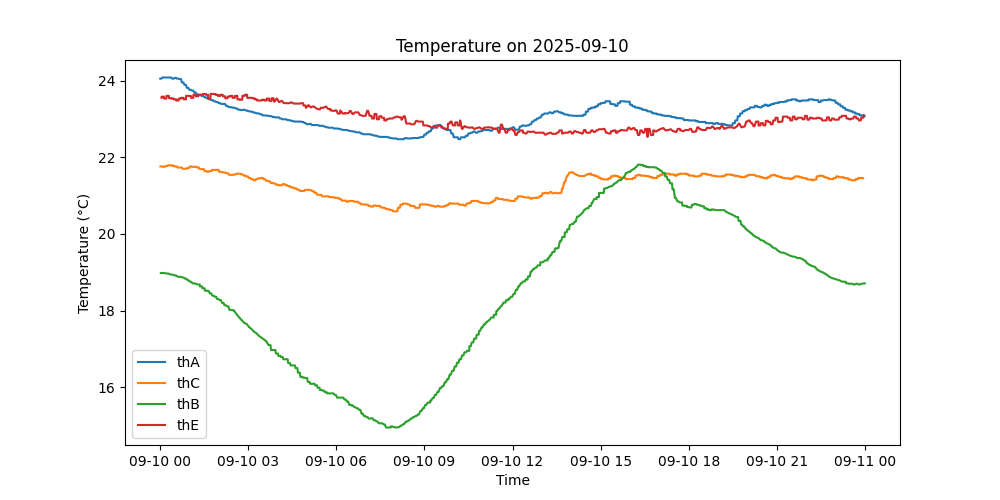
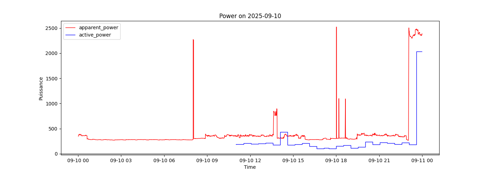

# Minimal Home Assistant

- Read ZigBee sensors using https://www.zigbee2mqtt.io/
- Store data to InfluxDB v1 
- Without HomeAssistant
- Run on a Raspberry

## Configuration for Zigbee2mqtt


```
sudo cp config/zigbee2mqtt/configuration.yaml /opt/zigbee2mqtt/data/
sudo systemctl restart zigbee2mqtt.service 
sudo systemctl status zigbee2mqtt.service 
```


note: To look at messages use mqttui  `mqttui -b mqtt://192.168.1.87`


## InfluxDB v1

see https://docs.influxdata.com/influxdb/v1/introduction/install/

and
```
sudo apt install influxdb-client
```


## Images
Temperatures and power usage daily graphs



