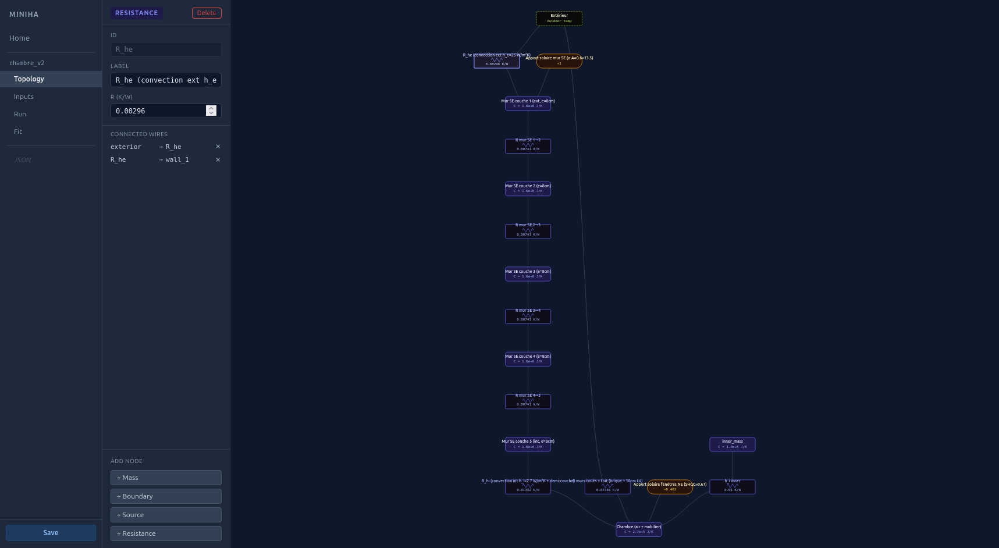
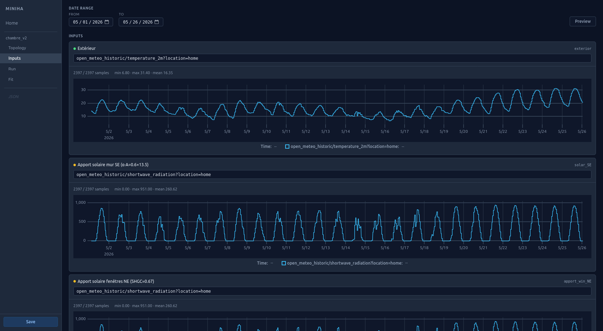
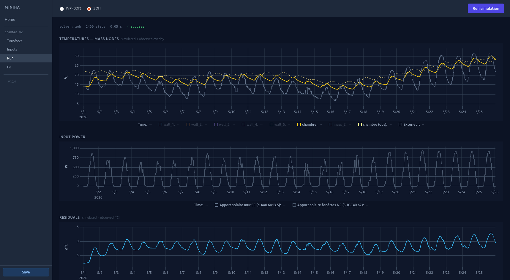
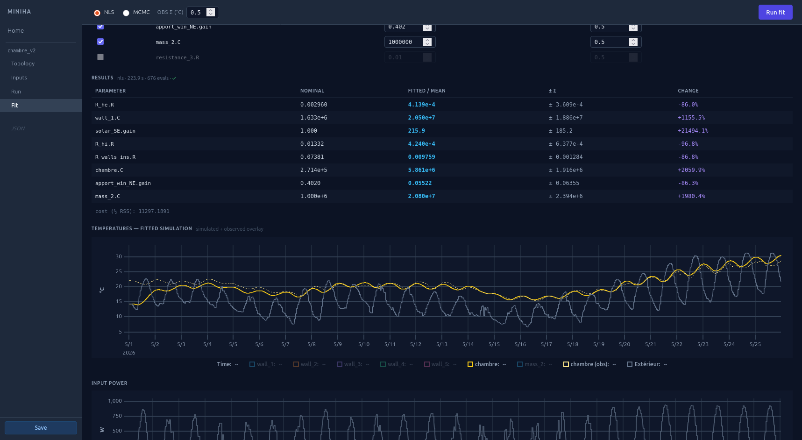

# thermalnodes

Sub-project of [miniha](../README.md). Build and simulate thermal RC networks of
buildings, room by room. Draw the topology on a node-graph canvas, assign signals
from InfluxDB, run forward simulations, and fit model parameters to sensor data.

```
[house description]  →  physics layer  →  RC graph  →  assembler  →  ODE
 material, area, λ       expand walls       R, C, edges    A, B matrices
```

The miniha parent project handles **data capture and logging** (InfluxDB).
thermalnodes consumes that data for **model identification**.

## Screenshots

<p align="center">
  
  
  
  
</p>

## Stack

| Layer | Choice |
|---|---|
| Model + study format | JSON |
| Solver | Python — `scipy` (IVP/BDF + ZOH) |
| Data source | InfluxDB (via `GET /signals`, `GET /series`) |
| API | FastAPI (port 8001) |
| UI | SvelteKit + `@xyflow/svelte` + uPlot |

## Running

```bash
# API
uv run uvicorn thermalnodes.api.main:app --reload --port 8001

# UI
cd thermalnodes/ui
npm install        # first time only
npm run dev        # http://localhost:5173
```

## Docs

- **[project_description.md](project_description.md)** — current state, architecture,
  data model, API surface, design decisions
- **[todo.md](todo.md)** — open work and changelog
